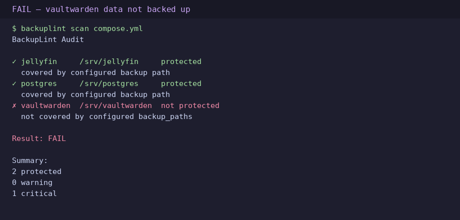
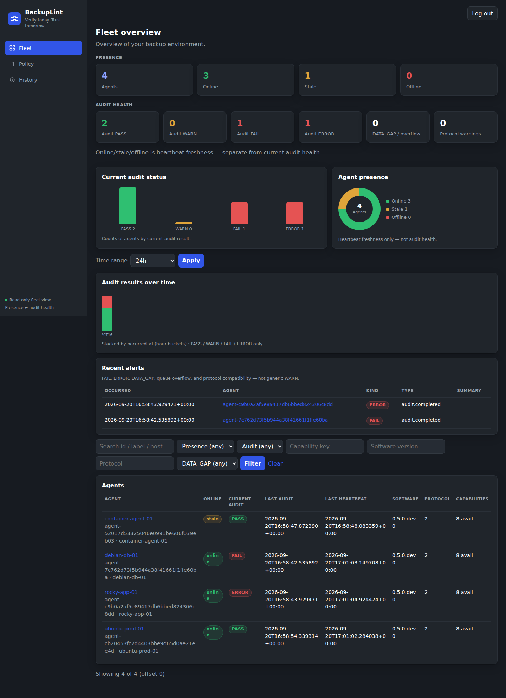
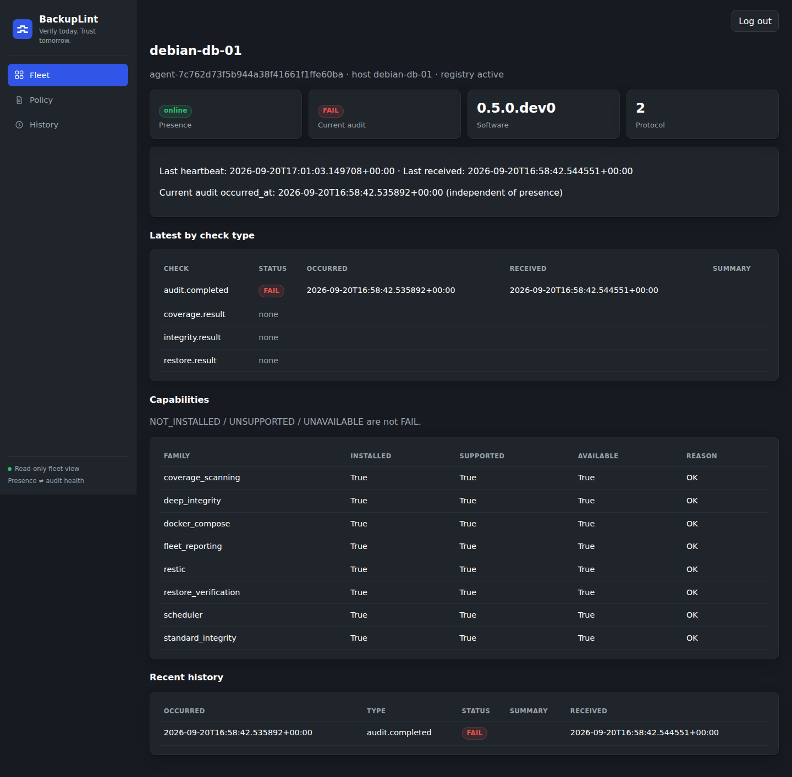
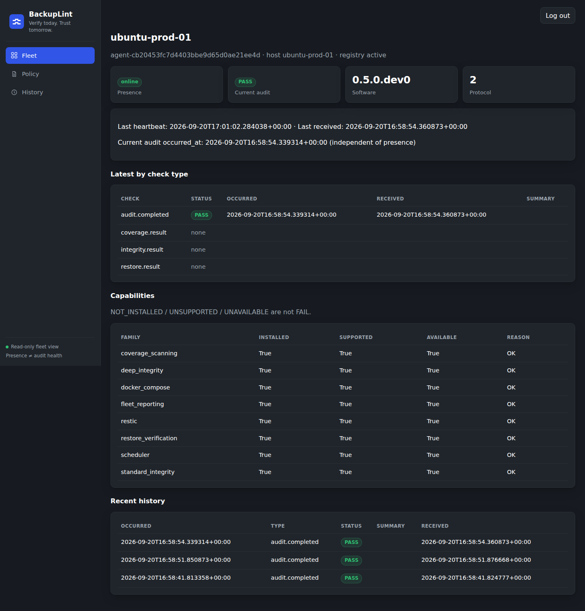
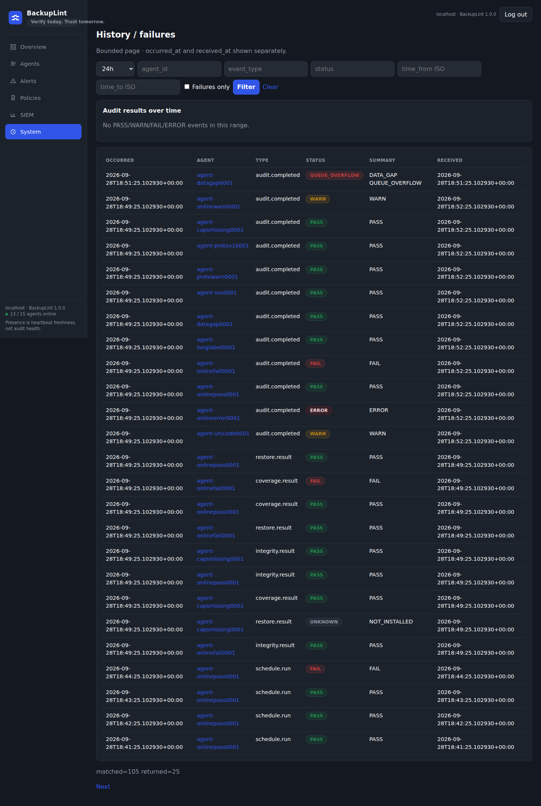
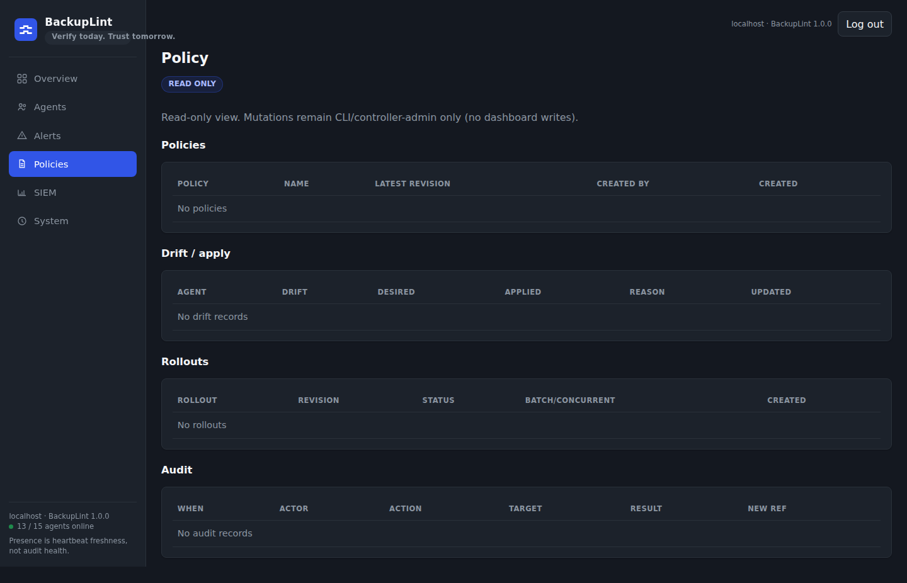
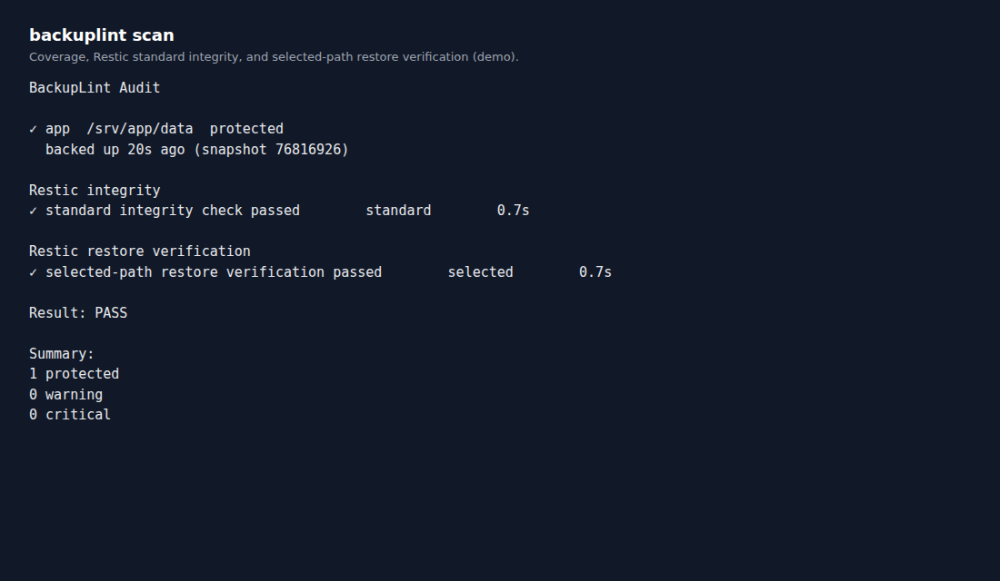
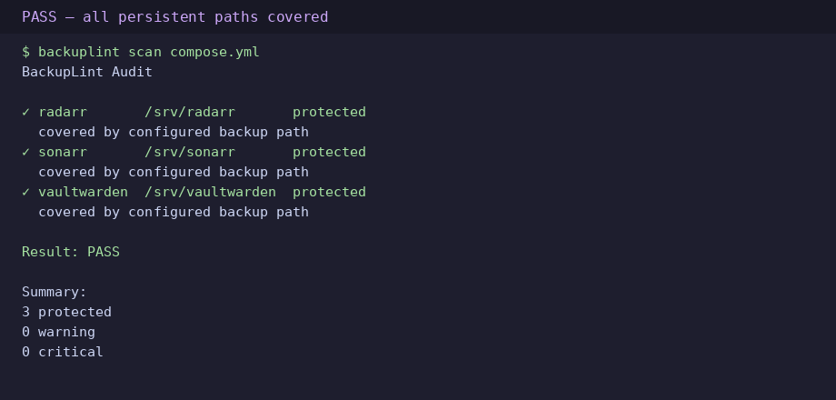
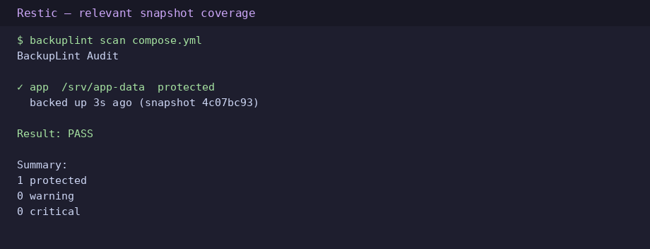

<p align="center">
  
</p>

<h1 align="center">BackupLint</h1>

<p align="center"><strong>Find Docker data your backups missed before you discover it during a restore.</strong></p>

<p align="center"><em>Don’t just assume your backups work. Prove they work.</em></p>

<p align="center">
  <code>backuplint scan compose.yml</code>
</p>

BackupLint is an **independent backup-assurance layer**. It is **not** a backup engine and does not replace Restic, Borg, Kopia, or your backup jobs. For v1, **Restic is the only supported backup engine** when engine-backed checks are enabled.

It is a read-only CLI, with an optional fleet controller/agent and dashboard, that compares Docker Compose mounts with your backup configuration and reports **PASS**, **WARN**, **FAIL**, or operational **ERROR**.

```bash
backuplint scan compose.yml
backuplint --version
```



## What it is

BackupLint answers one question:

> Does my Docker Compose stack contain persistent data that my backup configuration is not protecting?

Those checks stay separate:

```text
coverage ≠ integrity ≠ restore verification ≠ disaster recovery
presence (online / stale / offline) ≠ audit health
coverage FAIL ≠ repository-unavailable ERROR
```

See [docs/architecture.md](docs/architecture.md) for how the pieces fit together.

## Why it exists

Self-hosted Docker stacks accumulate bind mounts and named volumes. Backup jobs miss paths after services are added or renamed. BackupLint catches those gaps **before** a restore is needed.

## Key capabilities

- Compose mount discovery (`docker compose config`) and persistent / cache classification
- Static `backup_paths` coverage and named-volume mountpoint checks
- Optional Restic snapshot coverage, freshness (`max_backup_age`), standard/deep integrity, isolated restore verification
- Local scheduler (`backuplint daemon` / `backuplint schedule`)
- Optional fleet: HTTPS, one-time tokens, **CSR enrollment**, mTLS
- Optional read-only dashboard (presence ≠ audit health)
- Optional SIEM HTTPS export with a durable queue
- Central policy / GitOps (import-export-diff, assignment, drift, staged rollout)
- Native installer profiles and optional controller/agent containers (uid 10001, no Docker socket by default)
- Text and `--json` output with stable exit codes

## Screenshots

Public-safe demo fleet (synthetic labels). Presence and audit health remain separate.













## Quick start

Create `backuplint.yml` next to your Compose file (see `backuplint.yml.example`):

```yaml
backup_paths:
  - /srv/docker
  - /srv/app-config
```

```bash
backuplint scan path/to/compose.yml
backuplint scan path/to/compose.yml --config path/to/backuplint.yml
backuplint scan path/to/compose.yml --json
```

Example:

```text
BackupLint Audit

✓ sonarr       /srv/docker/sonarr    protected
✓ radarr       /srv/docker/radarr    protected
✗ vaultwarden  /srv/vaultwarden      not protected

Result: FAIL
```





## Native / bare-metal installation

Python 3.11+ (`venv`), Git, Docker Engine + Compose plugin for `scan`, and optional Restic on `PATH`.

```bash
git clone https://github.com/Netryon/BackupLint.git
cd BackupLint
python3 -m venv .venv
source .venv/bin/activate
pip install -e ".[dev]"
backuplint --version
```

Prefer a release wheel when you have one: `pip install backuplint-1.0.0-py3-none-any.whl`.

Full native path (roles, systemd, CSR enrollment, upgrades, uninstall): [docs/installation.md](docs/installation.md).

## Docker installation

Build locally; images are digest-pinned and run as uid **10001**.

```bash
docker build -f Dockerfile.controller -t backuplint-controller:1.0.0 .
docker build -f Dockerfile.agent -t backuplint-agent:1.0.0 .
```

Persistent `/state` volumes, mixed native/container topologies, and hardened flags: [docs/docker.md](docs/docker.md).

## How assurance states work

- **Coverage** — configured backup paths or Restic snapshot roots vs persistent Compose mounts.
- **Integrity** — `restic check` does **not** read every stored byte; `--read-data` is still not a restore.
- **Restore verification** — isolated restore into BackupLint-owned temp paths; not application consistency; not DR.
- **ERROR** — missing or unreachable repository (operational), not a coverage **FAIL**.
- **Presence** — heartbeat freshness on the dashboard, independent of last PASS/FAIL.

Restic password comes from `password_file`, `RESTIC_PASSWORD`, or `RESTIC_PASSWORD_FILE`. Configured `password_file` always wins. Passwords are never printed. BackupLint does not backup, prune, repair, or restore over live data.

Details: [docs/how-it-works.md](docs/how-it-works.md), [docs/integrity-checks.md](docs/integrity-checks.md), [docs/restore-verification.md](docs/restore-verification.md).

## Fleet and dashboard

```bash
backuplint controller init --data-dir ./bl-controller --hostname localhost
backuplint controller run --data-dir ./bl-controller --listen 127.0.0.1:8443
backuplint agent enroll --controller https://127.0.0.1:8443 \
  --token-file ./enroll.token --ca-cert ca.crt --identity-dir ./bl-agent
```

The agent generates its private key locally (CSR). After enrollment, heartbeats and submits use mTLS.

See [docs/fleet.md](docs/fleet.md) and [docs/dashboard.md](docs/dashboard.md).

## Central policy and SIEM

- Policy: immutable revisions, assignment, drift, staged rollout — [docs/central-policy.md](docs/central-policy.md)
- SIEM: durable HTTPS JSON export — [docs/siem.md](docs/siem.md)

## Supported platforms (v1.0.0 current-candidate)

| Platform | Arch | Current-candidate |
| --- | --- | --- |
| Ubuntu | x86_64 | tested |
| Debian | x86_64 | tested |
| Rocky Linux 9 | x86_64 | tested |
| Fedora 43 | x86_64 | tested |
| Raspberry Pi 4 Model B / Raspberry Pi OS | ARM64 | tested |
| Native controller + agent | — | tested |
| Container controller + agent, including mixed topologies | — | tested |

Raspberry Pi **3** is **not** a current-candidate proof. WSL2 is **unsupported**.

[docs/support-matrix.md](docs/support-matrix.md) · [docs/validation.md](docs/validation.md)

## Controller sizing

Evidence-backed **through 500 agents** on the tested 30s heartbeat/policy cadence (roughly **6–8 MB/agent/day** on the wire). That figure **excludes Restic backup payload**. Compact synthetic reports may be smaller than production. **Do not treat >500 agents as a certified production capacity.**

## Security model

Read-only diagnostics. No deletion of data, no modification of backups, no secret printing from Compose, `.env`, or backup tools.

Controller and agent images: digest-pinned `python:3.12-slim-bookworm`, Trivy-scanned, pcre2 High removed by a base refresh, remaining Critical/High reviewed as residual. **Not a “zero CVE” claim.** Agent: non-root uid 10001, unprivileged, no baked secrets, no Docker socket requirement.

[docs/security.md](docs/security.md) · [SECURITY.md](SECURITY.md)

## Testing and validation

```bash
source .venv/bin/activate
pytest -q tests/unit
sg docker -c 'source .venv/bin/activate && pytest -q tests/integration'
ruff check src tests
bandit -r src
```

Campaign-scale summaries (endurance, multi-VM, Pi 4, Trivy, sizing) without private lab data: [docs/validation.md](docs/validation.md). Raw evidence is retained privately.

## Known limitations

- Named volume coverage depends on local `docker volume inspect`; missing volumes are **WARN**, not FAIL
- Cache/temporary mounts are skipped by path heuristics
- Restic coverage uses snapshot path roots, not file-level contents
- Database image warnings are advisory; filesystem coverage is not a consistent DB backup
- Isolated restore verification is not a disaster-recovery drill
- Unit tests alone are not production readiness

## Documentation

| Topic | Doc |
| --- | --- |
| Native install | [docs/installation.md](docs/installation.md) |
| Docker | [docs/docker.md](docs/docker.md) |
| Architecture | [docs/architecture.md](docs/architecture.md) |
| Troubleshooting | [docs/troubleshooting.md](docs/troubleshooting.md) |
| Controller recovery | [docs/controller-recovery.md](docs/controller-recovery.md) |
| Native installer / systemd | [docs/native-installer.md](docs/native-installer.md) |
| Release notes | [docs/release-notes-v1.0.0.md](docs/release-notes-v1.0.0.md) |

## License

[MIT](LICENSE) © 2026 BackupLint contributors.

## Contributing and security reporting

[CONTRIBUTING.md](CONTRIBUTING.md) · [SECURITY.md](SECURITY.md)
