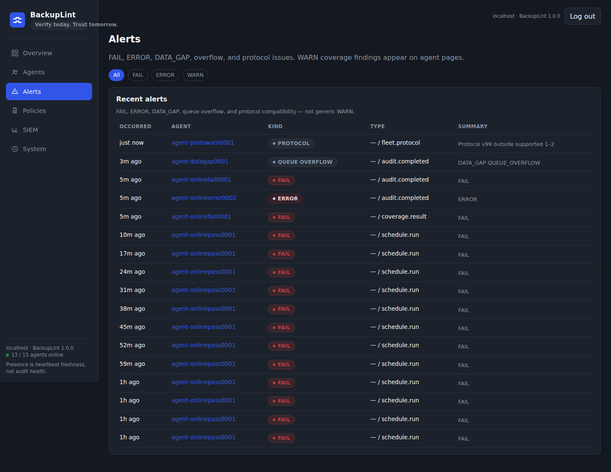

# BackupLint User Guide

**New users:** this is the start-here document. Follow it from install through a first audit, then use the links at the end for fleet, dashboard, and advanced topics.

BackupLint **v1.0.0** is on [PyPI](https://pypi.org/project/backuplint/) and in the [GitHub Release](https://github.com/Netryon/BackupLint/releases/tag/v1.0.0).

---

## 1. What BackupLint does

BackupLint is an independent **backup-assurance** layer for Docker Compose stacks. It does **not** create backups and does **not** replace [Restic](https://restic.net/). In v1, Restic is the only supported backup engine when engine-backed checks are enabled.

It answers four **separate** questions:

| Question | What BackupLint checks |
| --- | --- |
| Coverage | Are persistent Compose mounts under paths your backups (or Restic snapshots) actually include? |
| Freshness | Is the relevant snapshot recent enough (`max_backup_age`)? |
| Integrity | Does the Restic repository pass `restic check` (or optional `--read-data`)? |
| Restore verification | Can selected paths be restored into a **temporary** directory BackupLint owns? |

```text
coverage ≠ integrity ≠ restore verification ≠ disaster recovery
```

A PASS on one of those does not imply the others. A PASS is not a disaster-recovery guarantee.

---

## 2. Choose your deployment

BackupLint is **one package**. You pick a **role**:

| Role | Use when | What runs on this machine |
| --- | --- | --- |
| **Standalone** | One host, local assurance only | `scan` / `daemon`. No controller, no dashboard, no other agents. |
| **Agent** | This host reports to an existing controller | Local audits + mTLS report. No controller/dashboard here. |
| **Controller** | Dedicated management node | Receives agents, optional dashboard, policy, SIEM. Does not have to audit Compose on itself. |
| **All-in-one** | This host should audit **itself and** manage other agents | Local checks **and** the controller/dashboard on the same machine. |

```text
One machine only              → Standalone
Dedicated management node     → Controller
Additional monitored machine  → Agent
Main server + fleet on one box → All-in-one
```

**Standalone vs all-in-one:** standalone **never** runs a controller. All-in-one **does**: it is a controller that also audits the host it runs on. Stay on standalone unless you need a fleet.

Details: [installation.md](installation.md), [installation-profiles.md](installation-profiles.md).

---

## 3. Requirements

You do **not** need a single all-powerful admin account. Supply only what the role uses.

**Every local audit (standalone, agent, or all-in-one):**

- Python **3.11+** (`venv` recommended). Rocky/Alma 9: use `python3.11`.
- A Compose file (or `compose_files` in config) when you run `backuplint scan`.
- A BackupLint config file (`backuplint.yml`). It must define `backup_paths` (the list may be empty if you rely on Restic snapshot roots only, but the key must exist).
- Docker Engine + Compose plugin (`docker compose`) when Compose discovery is used.
- Restic on `PATH` **only** if you enable Restic-backed coverage, integrity, or restore verification.
- Access to the Restic repository and password **only** for those Restic-backed checks.

**Controller:** hostname/DNS agents will use (certificate SAN), listen address (typically `8443`), a data directory, optional dashboard password, optional SIEM config.

**Agent:** controller HTTPS URL, one-time enrollment token, agent id from `enroll-token`, controller CA certificate, plus local Compose/Restic access for the checks that agent will run.

---

## 4. Install BackupLint

The usual beginner path is **PyPI**:

```bash
python3 -m venv .venv
source .venv/bin/activate
pip install backuplint
backuplint --version
```

You should see `backuplint 1.0.0`.

**Other install methods** (when you need them):

- GitHub Release wheel: download `backuplint-1.0.0-py3-none-any.whl` from the [v1.0.0 release](https://github.com/Netryon/BackupLint/releases/tag/v1.0.0), then `pip install backuplint-1.0.0-py3-none-any.whl`.
- Native installer (directories, optional packages, systemd): `sudo backuplint install --interactive --yes`. See [native-installer.md](native-installer.md).
- Official images: `ghcr.io/netryon/backuplint-controller:1.0.0` and `ghcr.io/netryon/backuplint-agent:1.0.0` (`linux/amd64`). See [docker.md](docker.md).

Full native layout, roles, and uninstall: [installation.md](installation.md).

---

## 5. Your first local audit

Work on the Compose **host**. Create two files in the same directory (example paths only).

`compose.yml`:

```yaml
services:
  sonarr:
    image: lscr.io/linuxserver/sonarr:latest
    volumes:
      - /srv/docker/sonarr:/config
  vaultwarden:
    image: vaultwarden/server:latest
    volumes:
      - /srv/app-data/vaultwarden:/data
```

`backuplint.yml`:

```yaml
backup_paths:
  - /srv/docker
```

Scan:

```bash
backuplint scan compose.yml
backuplint scan compose.yml --config backuplint.yml --json
```

`--config` / `-c` defaults to `backuplint.yml` beside the Compose file (or `./backuplint.yml`).

Example text report when Vaultwarden is outside `/srv/docker`:

```text
BackupLint Audit

✓ sonarr       /srv/docker/sonarr         protected
✗ vaultwarden  /srv/app-data/vaultwarden  not protected

Result: FAIL
```

### Result states

| Result | Meaning |
| --- | --- |
| **PASS** | Evaluated persistent mounts are covered, and requested integrity/restore checks passed (or were not requested). **Not** “disaster recovery is guaranteed.” |
| **WARN** | Nothing critically uncovered, but something needs review (stale snapshot, missing named volume locally, advisory database note, skipped restore, and similar). Exit code `0`. |
| **FAIL** | An assurance condition failed: uncovered persistent data, Restic integrity **inconsistency**, or restore verification **failure**. Exit code `1`. |
| **ERROR** | The check could **not** be completed (bad config, Docker/Compose unavailable, Restic auth, missing/unreachable repository, lock, timeout). CLI `scan` prints the error and exits `2`. Fleet/dashboard store this as **ERROR**, not as coverage FAIL. |

```text
FAIL = assurance condition failed
ERROR = check could not finish operationally
WARN = advisory / needs attention
PASS = this check passed — not a DR certificate
```

---

## 6. Understand coverage

BackupLint asks Docker for the **resolved** Compose config (`docker compose -f … config --format json`), then classifies each mount.

**Persistent data** (in scope unless skipped):

- **Bind mounts** — host path on the left of `host:container`.
- **Named volumes** — Docker volume name; BackupLint uses `docker volume inspect` for the host mountpoint. If the volume does not exist locally, that is **WARN** (review required), not FAIL.

**Usually skipped** (cache / temporary / infrastructure):

- `tmpfs`
- container targets such as `/cache`, `/.cache`, `/var/cache`, `/tmp`, `/var/tmp`, `/run`, `/dev/shm`
- obvious infrastructure binds such as `/etc/localtime`, `/etc/timezone`, the Docker socket, and read-only host CA/zoneinfo mounts (unless you list them in `backup_paths`)

**“Covered”** means a configured `backup_paths` entry is the mount’s host path or a **parent directory** of it (pathlib rules, not string prefix). `/srv/app` does **not** cover `/srv/app2`. Backing up `/srv/docker/sonarr` does **not** cover `/srv/docker`.

A backup job can succeed every night and still miss application data: the job only copies what it was told. If Compose adds `/srv/app-data/vaultwarden` and Restic still only includes `/srv/docker`, BackupLint reports that mount **not protected**.

---

## 7. Connect Restic

Add a `restic` section when you want snapshot-based coverage, freshness, integrity, or restore verification.

```yaml
backup_paths:
  - /srv/docker
  - /srv/app-data

max_backup_age: 24h

restic:
  repository: /var/backups/restic
  password_file: /etc/backuplint/restic.pass
```

Use a password file owned by the BackupLint user, mode `0600`. Do not put the password in YAML. Example (placeholders only):

```bash
install -m 0600 /dev/null /etc/backuplint/restic.pass
# write the repository password into that file; never commit it
```

You can also use a `restic.password` **SecretRef** (`file`, `env`, `systemd`, `mounted`). Inline password strings in config are rejected. See [secrets.md](secrets.md).

**Password precedence** (first match wins; no silent fallback after a failed resolve):

1. `restic.password` SecretRef
2. `restic.password_file` (legacy file path)
3. ambient `RESTIC_PASSWORD`
4. ambient `RESTIC_PASSWORD_FILE`

A configured password source clears leftover ambient Restic password env vars before use.

Then run the same scan:

```bash
backuplint scan compose.yml -c backuplint.yml
```

BackupLint lists snapshots with `restic snapshots --json` and matches **relevant** snapshot roots to each mount. A newer snapshot of `/etc` does not hide a stale snapshot of `/srv/docker`.

---

## 8. Integrity checks

Integrity is **repository** health. It is not restore verification.

| Mode | What runs | What it proves | What it does not prove |
| --- | --- | --- | --- |
| `off` (default) | nothing | — | — |
| `standard` | `restic check` | Repository structure, indexes, trees, pack metadata | That a restore will work, that the app boots, that a database is consistent |
| `deep` | `restic check --read-data` | Standard checks **plus** reading data blobs | Same as above. **Not** a successful restore. |

Config:

```yaml
restic:
  repository: /var/backups/restic
  password_file: /etc/backuplint/restic.pass
  integrity:
    mode: standard    # off | standard | deep
```

CLI override (wins over config):

```bash
backuplint scan compose.yml --integrity off
backuplint scan compose.yml --integrity standard
backuplint scan compose.yml --integrity deep
```

`deep` is I/O-heavy. Integrity inconsistency → **FAIL**. Auth/missing repo/lock/timeout → **ERROR** (exit `2`).

Details: [integrity-checks.md](integrity-checks.md).

---

## 9. Restore verification

When enabled, BackupLint:

1. Creates a BackupLint-owned temporary restore destination,
2. Refuses unsafe/live destinations (`/`, home roots, the repository, live audited paths),
3. Restores selected relevant paths with Restic,
4. Checks that expected restored content exists and is readable,
5. Cleans up that temporary directory,
6. Never intentionally restores over live application data.

| Mode | Meaning |
| --- | --- |
| `off` (default) | Skip |
| `selected` | Restore relevant audited paths from the relevant snapshot(s) |
| `full` | Restore all relevant audited paths (same path set as selected in current v1) |

```yaml
restic:
  repository: /var/backups/restic
  password_file: /etc/backuplint/restic.pass
  restore_verification:
    mode: selected          # off | selected | full
    timeout: 30m            # optional
    expected_paths:         # optional paths relative to restored roots
      - config.json
```

```bash
backuplint scan compose.yml --restore-verify selected
```

This is **filesystem** restore verification, not application-level disaster recovery. Databases still need app-aware recovery (dumps, consistent snapshots, vendor tools).

Details: [restore-verification.md](restore-verification.md).

---

## 10. Schedule checks

Local recurring checks (no fleet required):

```yaml
schedule:
  history_limit: 500
  coverage:
    every: 30m
  integrity:
    every: 6h
  restore_verification:
    every: 24h
  deep_integrity:
    every: 7d
```

Disable a job with `enabled: false`. Unknown keys are rejected.

```bash
backuplint daemon compose.yml -c backuplint.yml
backuplint schedule status compose.yml -c backuplint.yml
backuplint schedule next compose.yml -c backuplint.yml
backuplint schedule history compose.yml -c backuplint.yml
backuplint schedule run compose.yml coverage -c backuplint.yml
```

`backuplint daemon` runs in the foreground until SIGTERM/SIGINT. For production, use systemd via the native installer ([native-installer.md](native-installer.md)). Restart the daemon after config changes.

Job types force modes for that run (`coverage` turns integrity/restore off; `integrity` uses standard; `deep_integrity` uses deep; `restore_verification` uses selected restore).

Optional `fleet:` on the same config can submit scheduled results to a controller after each check.

Details: [scheduling.md](scheduling.md).

---

## 11. Fleet mode

```text
Controller
   ↑ HTTPS + mTLS (after enrollment)
Agents
```

- Mint a **one-time** enrollment token on the controller (`enroll-token`).
- The **agent generates its private key locally** and sends a **CSR**.
- The controller signs the CSR. The **agent private key is never copied to the controller**.
- After enrollment, traffic is **mTLS**. Tokens are one-use.

Minimum lab path (placeholders only):

```bash
# Controller
backuplint controller init --data-dir ./bl-controller --hostname controller.example
backuplint controller dashboard-password --data-dir ./bl-controller
backuplint controller run --data-dir ./bl-controller --listen 127.0.0.1:8443 --dashboard

# Other terminal: mint token (printed once)
backuplint controller enroll-token --data-dir ./bl-controller --label web1

# Agent (copy ca.crt first)
backuplint agent enroll \
  --controller https://controller.example:8443 \
  --token "$ENROLL_TOKEN" \
  --agent-id "$AGENT_ID" \
  --ca-cert ./bl-controller/ca/ca.crt \
  --identity-dir ./bl-agent

backuplint agent run --controller https://controller.example:8443 --identity-dir ./bl-agent
```

`--hostname` on `init` / `run` must match how agents connect (certificate SAN). Revoke with `backuplint controller revoke <agent_id>`.

Dashboard: `https://controller.example:8443/dashboard/` after `--dashboard` and a password hash.

A Docker socket is **not** required for enrollment, heartbeat, or policy. Compose discovery still needs Docker on the machine that runs `scan` / `submit`.

Full commands and protocol notes: [fleet.md](fleet.md). Containers: [docker.md](docker.md). Policy: [central-policy.md](central-policy.md).

---

## 12. Dashboard

Optional **read-only** UI on the controller. v1 auth is a **shared operator password** (scrypt hash). No SSO/RBAC in v1.

Look at these pages first:

| Page | Why |
| --- | --- |
| **Overview** | Fleet cards, alerts, compact agent table |
| **Agents** | Presence vs audit, services, last audit |
| **Alerts** | FAIL / ERROR / WARN with project/service/mount links |
| **Policies** | Read-only policy, drift, rollout |
| **SIEM** | Export **queue** health — not backup truth |
| **System** | Bounded event history |

**Presence** (online / stale / offline) is heartbeat freshness. **Audit health** is PASS / WARN / FAIL / ERROR from stored scans. An agent can be **offline** and still show an old **PASS**.

Drill-down: agent → Compose **project** → **service** → **mount**. Coverage FAIL is per-mount. Repository ERROR is operational, not “this bind is uncovered.”




More: [dashboard.md](dashboard.md).

---

## 13. Common real-world examples

### Example A — new Docker volume added but not backed up

Compose grows a bind `/srv/app-data/vaultwarden`. `backup_paths` still lists only `/srv/docker`. BackupLint marks that mount **not protected** and the audit **FAIL**. The Restic job may still “succeed” because it never included that path.

### Example B — Restic repository unavailable

Wrong URL, network down, or bad credentials. BackupLint cannot finish snapshot listing or `restic check`. That is **ERROR** (exit `2`), not coverage FAIL. Do not treat it as “all mounts are uncovered.”

### Example C — backup is too old

Paths are covered by a snapshot, but `max_backup_age: 24h` and the relevant snapshot is older. That mount is **stale** → overall **WARN** (when nothing is critically uncovered). Coverage still passed; freshness did not.

### Example D — restore verification passes

Selected paths restored into a temp directory and files were readable. That proves **those files came out of Restic into an isolated directory**. It does not prove the application boots, DNS works, or a database is transaction-consistent.

---

## 14. What BackupLint does not do

- Does not create backup payloads or run your backup jobs
- Does not replace Restic
- Does not automatically prove database consistency
- Does not automatically prove the application boots after restore
- Does not equal disaster recovery
- Does not support Borg or Kopia in v1
- Does not provide SSO or RBAC in v1
- Does not require a Docker socket for controller enrollment, heartbeat, or policy

---

## 15. Troubleshooting

| Symptom | First check |
| --- | --- |
| Docker unavailable | Docker Engine, Compose plugin, permission to the Docker API (often `docker` group) |
| Restic unavailable | `restic` installed and on `PATH` |
| Repository ERROR | repo URL/path, network, credentials, locks |
| Named volume warning | volume exists locally (`docker volume inspect`) |
| Agent offline | controller URL, CA, cert SAN / hostname, mTLS after enroll |
| Restore ERROR | repo/credentials, temp disk space, timeout |
| Dashboard inaccessible | `--dashboard`, password hash, HTTPS URL, firewall to `8443` |

Full list: [troubleshooting.md](troubleshooting.md).

---

## 16. Where to go next

- [Installation](installation.md)
- [Docker](docker.md)
- [Fleet](fleet.md)
- [Dashboard](dashboard.md)
- [Restore verification](restore-verification.md)
- [Integrity checks](integrity-checks.md)
- [Scheduling](scheduling.md)
- [SIEM](siem.md)
- [Central policy](central-policy.md)
- [Troubleshooting](troubleshooting.md)
- [Security](security.md)
- [Validation evidence](validation.md)
- [How it works](how-it-works.md)
- [Secrets](secrets.md)
- [Support matrix](support-matrix.md)
- [Release notes v1.0.0](release-notes-v1.0.0.md)
